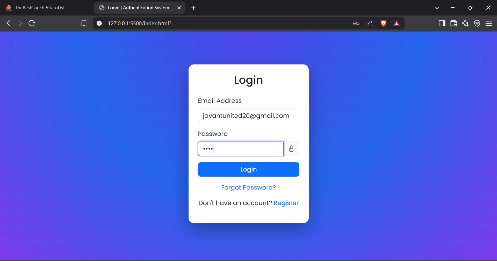
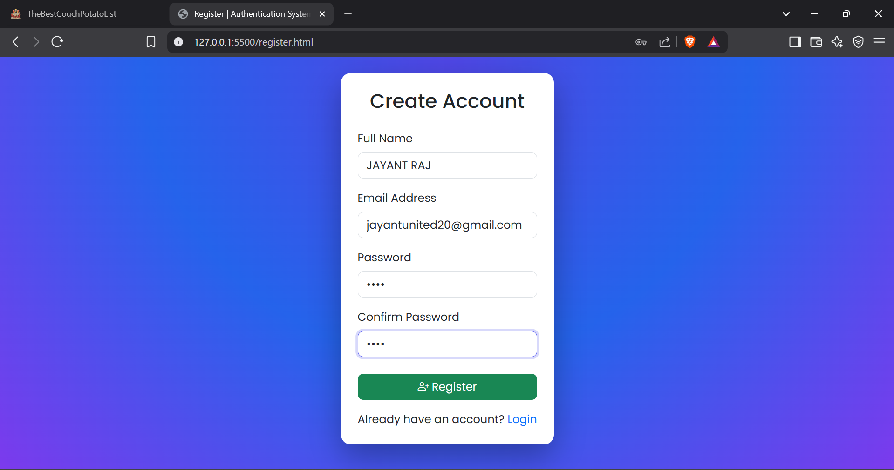

# Authentication System (Bootstrap Styled)

## Overview

This project is a **Bootstrap-styled authentication system UI** created as an extension of the previous HTML-only assignment.
The application demonstrates common authentication workflows including **Login, Registration, Password Recovery, and Dashboard access**.

The goal of this project is to transform a basic HTML authentication interface into a **professional, responsive, and visually appealing web application** using **Bootstrap 5 and custom CSS**.

This project focuses on:

* UI design
* Responsive layout
* Clean code structure
* Proper commenting and readability

> Note: This project simulates authentication flow using HTML navigation. It does **not include backend authentication or database functionality.**

---

## Features

* Login interface with Bootstrap form styling
* User registration page
* Forgot password request page
* Password reset page
* Dashboard interface with navigation bar
* Responsive layout for different screen sizes
* Custom styling using external CSS
* Professional UI with Bootstrap components

---

## Technologies Used

* **HTML5**
* **Bootstrap 5**
* **Bootstrap Icons**
* **Custom CSS**
* **Google Fonts (Poppins)**

---

## Project Structure

```
html-authentication-poc
│
├── index.html              # Login Page
├── register.html           # Registration Page
├── forgot-password.html    # Forgot Password Page
├── reset-password.html     # Reset Password Page
├── dashboard.html          # Dashboard Page
│
├── styles.css              # Custom styling
├── README.md               # Project documentation
│
└── screenshots
      ├── login.png
      ├── register.png
      ├── forgot-password.png
      ├── reset-password.png
      └── dashboard.png
```

---

## Page Descriptions

### Login Page (`index.html`)

Allows existing users to enter their credentials and navigate to the dashboard.

### Registration Page (`register.html`)

Allows new users to create an account by providing personal information.

### Forgot Password Page (`forgot-password.html`)

Allows users to request a password reset link using their registered email.

### Reset Password Page (`reset-password.html`)

Allows users to create a new password after requesting a reset.

### Dashboard Page (`dashboard.html`)

Displays a welcome interface after successful login with navigation and action buttons.

---

## Screenshots

### Login Page



### Registration Page



### Forgot Password Page


* Laptop (1366px – 1920px)
* Tablet (768px – 1024px)
* Mobile (320px – 767px)

Bootstrap's grid system and utility classes ensure proper layout adjustments.

---

## Author

Assignment submission for **HTML & Bootstrap Authentication System UI**.
